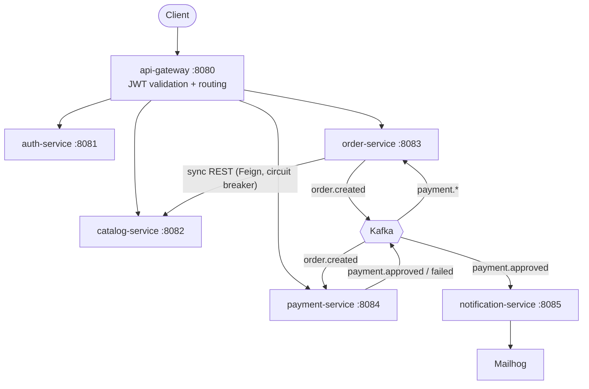

# OrderHub — Distributed Order Processing Platform

A portfolio project showing how to build a small commerce domain as **event-driven Java microservices** — with synchronous and asynchronous communication, resilience, and full observability, kept deliberately focused rather than over-engineered.

> 📐 Full design rationale, diagrams, and a new-developer guide: **[docs/ARCHITECTURE.md](docs/ARCHITECTURE.md)**

## Architecture



**Order lifecycle (choreography Saga):**
1. `POST /api/v1/orders` → order-service prices items from the catalog, saves the order as `PENDING`, publishes `order.created`.
2. payment-service consumes it, decides the payment, publishes `payment.approved` or `payment.failed`.
3. order-service consumes the result → `CONFIRMED` / `PAYMENT_FAILED`; notification-service emails the customer.

## Tech stack

| Layer | Technology |
|---|---|
| **Runtime** | Java 21, Spring Boot 3.4.1, Spring Cloud 2024.0 |
| **API Gateway** | Spring Cloud Gateway, JJWT 0.12 (JWT validated once at the edge) |
| **Messaging** | Apache Kafka — topics `order.created`, `payment.approved`, `payment.failed` |
| **Persistence** | PostgreSQL 16 (one DB per stateful service), Redis 7 (catalog cache-aside), Flyway migrations |
| **Service comms** | Spring Cloud OpenFeign (sync) + Kafka (async) |
| **Resilience** | Resilience4j circuit breaker + fallbacks on the Feign clients |
| **Observability** | Micrometer → Prometheus + Grafana; JSON logs → Loki (Promtail); OpenTelemetry → Jaeger |
| **Testing** | JUnit 5, Mockito, Testcontainers (PostgreSQL/Kafka/Redis), Pact (consumer + provider) |
| **API docs** | SpringDoc OpenAPI / Swagger UI per service |
| **Build & deploy** | Maven multi-module, Docker Compose, GitHub Actions CI |

## Running locally

**Prerequisites:** Docker (Docker Desktop with BuildKit). Java 21 + Maven are only needed to run tests or a service outside Docker.

```bash
# Build every image and start the whole system (infra + 6 services)
docker compose up -d --build

# Tail logs / stop
docker compose logs -f order-service
docker compose down
```

The first build compiles all modules inside the images, so it takes a few minutes; subsequent starts are fast.

| Tool | URL |
|---|---|
| API Gateway (entry point) | http://localhost:8080 |
| Swagger UI (per service) | http://localhost:808x/swagger-ui.html |
| Grafana | http://localhost:3000 (admin / admin) |
| Prometheus | http://localhost:9090 |
| Jaeger (traces) | http://localhost:16686 |
| Mailhog (dev email) | http://localhost:8025 |

## Example: end to end

```bash
# 1. Register and capture the JWT
TOKEN=$(curl -s -X POST http://localhost:8080/auth/register \
  -H 'Content-Type: application/json' \
  -d '{"email":"marcos@orderhub.com","password":"password123","firstName":"Marcos","lastName":"Dias"}' \
  | jq -r .token)

# 2. Create a product (returns its id)
PID=$(curl -s -X POST http://localhost:8080/api/v1/products \
  -H "Authorization: Bearer $TOKEN" -H 'Content-Type: application/json' \
  -d '{"name":"Burger","description":"Cheese burger","price":25.90,"category":"food"}' \
  | jq -r .id)

# 3. Place an order — the client sends only productId + quantity; the server prices it
curl -s -X POST http://localhost:8080/api/v1/orders \
  -H "Authorization: Bearer $TOKEN" -H 'Content-Type: application/json' \
  -d "{\"items\":[{\"productId\":\"$PID\",\"quantity\":2}]}" | jq

# 4. A moment later, the Saga has run — check the payment result
#    (order status becomes CONFIRMED; an email lands in Mailhog)
curl -s http://localhost:8080/api/v1/orders/{orderId}/payment \
  -H "Authorization: Bearer $TOKEN" | jq
```

## API reference

All traffic goes through the gateway. Protected routes require `Authorization: Bearer <token>`.

**Auth** — `POST /auth/register`, `POST /auth/login` → `{ token, tokenType, email, role }`

**Catalog** — `GET /api/v1/products` (paginated), `GET /api/v1/products/{id}`, `GET /api/v1/products/category/{cat}`, and `POST` / `PUT` / `DELETE` (auth required)

**Orders** *(auth required)*
```
POST /api/v1/orders            body: { "items": [ { "productId", "quantity" } ] }  → 201, triggers the Saga
GET  /api/v1/orders/{id}       order with status
GET  /api/v1/orders/{id}/payment   payment detail (sync call to payment-service, Pact-tested)
GET  /api/v1/orders/my         current user's orders
```

**Payments** *(auth required)* — `GET /api/v1/payments/{id}`, `GET /api/v1/payments/order/{orderId}`

## Testing

```bash
mvn test                              # unit + contract tests (all modules)
mvn verify -pl order-service -Dgroups=integration   # Testcontainers (needs Docker)
mvn verify -pl catalog-service jacoco:report        # coverage report
```

- **Unit** — Mockito for services, filters, and resilience fallbacks.
- **Integration** — `@Tag("integration")` Testcontainers spin up real PostgreSQL/Kafka/Redis; no infrastructure is mocked.
- **Contract** — Pact: `order-service` (consumer) pins the `GET /payments/order/{id}` contract it really calls; `payment-service` (provider) verifies it.

## Key design decisions

- **Async for commands, sync for queries.** Payment runs after the order exists and fans out to multiple consumers → Kafka. Reading a price or a payment detail is immediate → REST/Feign.
- **Never trust a client price.** The order request carries only `productId` + `quantity`; the server resolves the authoritative price from the catalog and computes the total.
- **Circuit breaker where it works.** Resilience4j wraps the Feign proxies. Catalog down → fail fast (`503`, you can't price blindly); payment query down → degrade to `UNKNOWN` status.
- **Consistent errors.** Every service returns RFC 7807 `application/problem+json`.
- **One DB per service, JWT once at the gateway.** Boundaries are enforced; downstream services trust forwarded `X-User-*` headers.

Full trade-off discussion in [docs/ARCHITECTURE.md](docs/ARCHITECTURE.md).

## Project structure

```
orderhub/
├── api-gateway/            Spring Cloud Gateway + JWT filter
├── auth-service/           Register/login, JWT, PostgreSQL
├── catalog-service/        Product CRUD, Redis cache-aside
├── order-service/          Order creation, Feign clients, Kafka producer + Saga consumer
├── payment-service/        order.created consumer, payment.* producer, Pact provider
├── notification-service/   payment.approved consumer, email via Mailhog
├── infra/                  prometheus, grafana, loki, promtail configs
├── k8s/ · helm/            Kubernetes manifests and Helm chart
├── docs/ARCHITECTURE.md    Full architecture guide
└── docker-compose.yml      The entire system, one command
```

## Roadmap

Seed data + HTTP collection · committed Grafana dashboards · idempotent consumers + dead-letter topic · outbox pattern for reliable publishing · consolidate k8s/Helm · Pact Broker in CI. See [docs/ARCHITECTURE.md](docs/ARCHITECTURE.md#10-evolution-roadmap).
