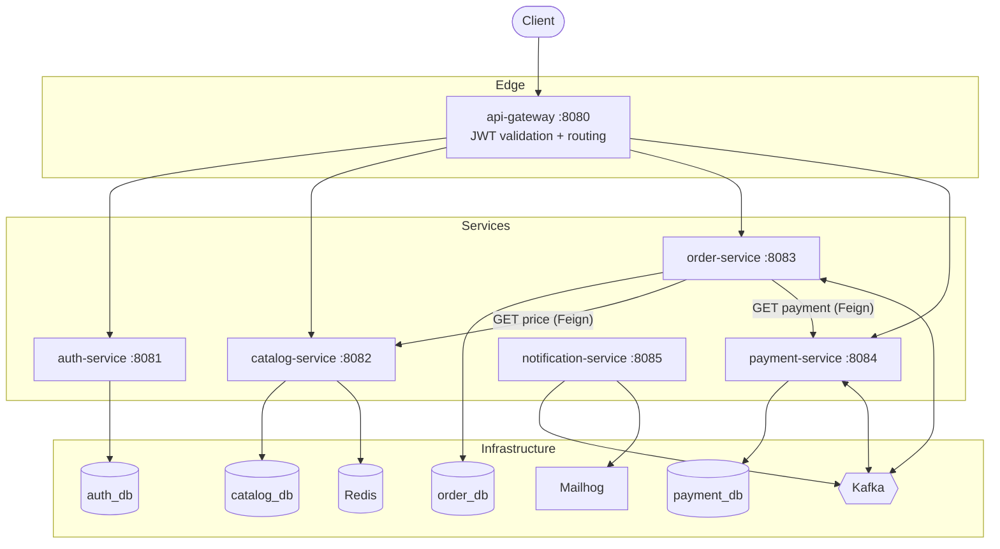
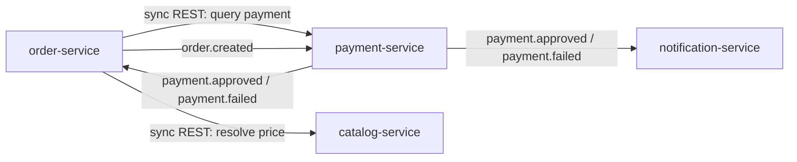
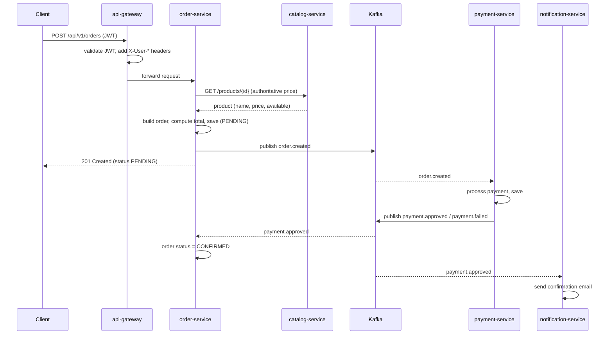
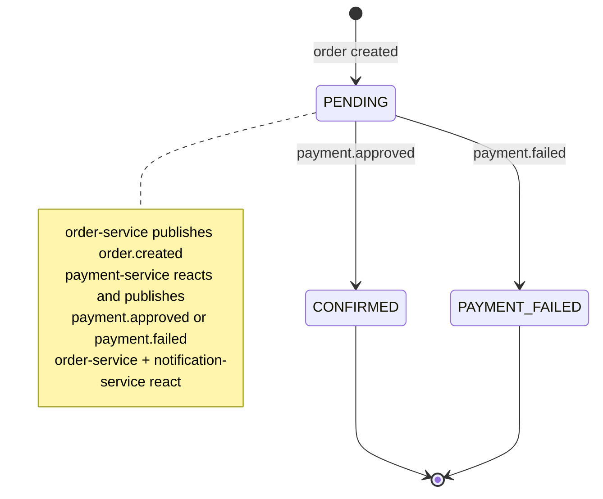
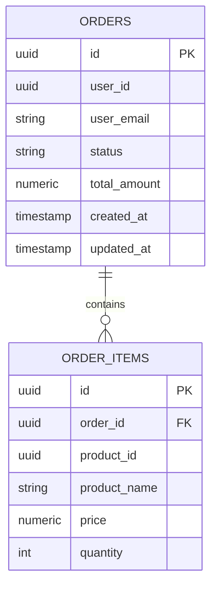

# OrderHub — Architecture Guide

> Written for a developer joining the project. It explains **what** OrderHub is, **how** it is built, and — most importantly — **why** each decision was made. Every explanation reflects the real code in this repository.

## Table of contents

1. [Overview](#1-overview)
2. [Architecture](#2-architecture)
3. [Folder structure](#3-folder-structure)
4. [Walkthrough: creating an order](#4-walkthrough-creating-an-order)
5. [Architectural decisions](#5-architectural-decisions)
6. [Communication between services](#6-communication-between-services)
7. [Databases](#7-databases)
8. [Patterns used](#8-patterns-used)
9. [Guide for new developers](#9-guide-for-new-developers)
10. [Evolution roadmap](#10-evolution-roadmap)
11. [Observability](#11-observability)
12. [Purpose of this document](#12-purpose-of-this-document)

---

## 1. Overview

**OrderHub** is a distributed order-processing platform: a customer authenticates, browses a product catalog, places an order, and the order is charged and confirmed asynchronously — with the customer notified by email.

**Problem it solves (and demonstrates):** how to split a small commerce domain into independent services that communicate both **synchronously** (REST) and **asynchronously** (events), while staying observable, resilient, and testable — the everyday concerns of a production microservices system.

**Chosen architecture:** five Spring Boot microservices behind a single API gateway, with a **choreography-based Saga** coordinating the order → payment → confirmation flow over Kafka.

**Why this architecture:**
- The order lifecycle is genuinely **event-driven** — payment happens after the order exists and should not block the caller. That is a real reason for asynchronous messaging, not decoration.
- Each service owns a **distinct capability** (identity, catalog, orders, payments, notifications) with its own database, so they can evolve and scale independently.
- A single **gateway** gives one entry point and one place to validate JWTs, so downstream services trust a forwarded identity instead of re-implementing auth.

---

## 2. Architecture

### 2.1 General architecture



### 2.2 Service communication



- **Solid business rule:** commands that change state flow **asynchronously** through Kafka; reads/queries flow **synchronously** through REST.

### 2.3 Request flow (create order)



### 2.4 Event flow (choreography Saga)



### 2.5 Infrastructure

Everything runs from one `docker compose up -d --build`: four PostgreSQL instances (one per stateful service), Redis, Kafka + Zookeeper, Mailhog, and the observability stack (Prometheus, Grafana, Loki + Promtail, Jaeger). All six apps are containerized and join the same network, so metrics, logs, and traces are collected automatically.

---

## 3. Folder structure

Each service is an independent Maven module with the same layered layout. Example — `order-service`:

```
order-service
├── controller   REST endpoints (thin; no business logic)
├── service      Business logic and transactions
├── entity       JPA entities + the OrderStatus enum (the domain model)
├── repository   Spring Data JPA repositories
├── dto          Request/response records (the API contract)
├── client       Feign clients to other services (+ resilience fallbacks)
├── event        Event records this service produces/consumes over Kafka
├── kafka        Kafka producers and @KafkaListener consumers
├── exception    Domain exceptions + GlobalExceptionHandler (RFC 7807)
└── OrderServiceApplication.java
```

| Directory | Responsibility | When to add here |
|---|---|---|
| `controller` | Map HTTP ↔ service calls, validate input, set status codes | A new endpoint |
| `service` | Business rules, orchestration, `@Transactional` boundaries | New behavior/use case |
| `entity` | Persistent domain model | A new table/aggregate |
| `repository` | Data access | A new query |
| `dto` | API request/response shapes (records) | A new request/response |
| `client` | Synchronous calls to other services + fallbacks | Calling another service |
| `event` | Message contracts | A new event produced/consumed |
| `kafka` | Publish/subscribe wiring | A new producer/consumer |
| `exception` | Error types + HTTP mapping | A new error case |

Not every service has every folder: `catalog-service` adds `config` (Redis), `auth-service` adds `config` (Spring Security) and `service/JwtService`, `notification-service` has no `repository` (it is stateless).

---

## 4. Walkthrough: creating an order

The full path of `POST /api/v1/orders`, file by file:

1. **Gateway** (`JwtAuthenticationFilter`) — validates the `Authorization: Bearer` JWT, extracts the claims, and forwards the request with `X-User-Id`, `X-User-Email`, `X-User-Role` headers. Public paths (`/auth/**`) skip this.
2. **Controller** (`OrderController.createOrder`) — reads the identity headers and the validated body (`CreateOrderRequest`: a list of `productId` + `quantity` only).
3. **Service** (`OrderService.createOrder`) — for each item, calls **catalog-service** through `CatalogClient` (Feign, wrapped by a circuit breaker) to get the **authoritative** name and price. The client never dictates the price. Unavailable product → `422`; catalog down → `503`.
4. **Domain** (`Order.recalculateTotal`) — the order computes its own total from the resolved item prices (an invariant owned by the entity).
5. **Repository** — the order is persisted with status `PENDING` (Flyway-managed schema).
6. **Producer** (`OrderProducer`) — publishes an `OrderCreatedEvent` to the `order.created` topic, keyed by order id.
7. **Response** — `201 Created` with the order (still `PENDING`). The caller is not blocked waiting for payment.
8. **Async continuation** — `payment-service` consumes `order.created`, decides the payment, and publishes `payment.approved` / `payment.failed`. `order-service` consumes those to move the order to `CONFIRMED` / `PAYMENT_FAILED`; `notification-service` consumes `payment.approved` and emails the customer.
9. **Query path** — later, `GET /api/v1/orders/{id}/payment` calls `payment-service` synchronously via `PaymentClient` to return the payment detail (with a graceful `UNKNOWN` fallback if payment is unreachable).

---

## 5. Architectural decisions

Each decision lists its trade-off.

**Why an API gateway?** One entry point, one place to validate JWTs. Downstream services trust the forwarded `X-User-*` headers instead of each re-parsing tokens. Trade-off: the gateway is a single point of failure and an extra hop — acceptable for the clarity it buys.

**Why OpenFeign for sync calls?** Declarative HTTP clients read like interfaces, keep the calling code clean, and integrate natively with Spring Cloud CircuitBreaker. Trade-off: another abstraction vs. `RestClient`, justified by the circuit-breaker integration and readability.

**Why Kafka (and is it justified)?** Yes. Payment happens *after* the order exists and must not block the caller; multiple services react to the same payment result (order **and** notification). That is a genuine publish/subscribe, event-driven need. Trade-off: operational weight (broker, serialization, at-least-once semantics) — worth it because the domain is actually asynchronous.

**Why a choreography Saga (no orchestrator)?** The flow is short and linear (order → payment → confirm). Choreography keeps each service autonomous with no central coordinator. Trade-off: harder to see the whole flow in one place; for longer flows an orchestrator (e.g., a state machine) would be clearer — noted in the roadmap.

**Why keep Redis?** `catalog-service` reads are read-heavy and product data changes rarely — a textbook **cache-aside** case. Values are cached as plain JSON with a configurable TTL and evicted on write. Trade-off: cache invalidation complexity, kept minimal by evicting on every update/delete.

**Why Resilience4j on the Feign clients?** A slow or down catalog/payment service should not cascade. The circuit breaker wraps the **Feign proxy** (not an in-class method — that was a real bug fixed during the rewrite), with meaningful fallbacks: catalog failure fails fast (`503`, you cannot price an order blindly), payment-query failure degrades gracefully (`UNKNOWN`). Trade-off: extra configuration for behavior you only see under failure.

**Why Pact contract tests?** `order-service` really calls `payment-service`'s `GET /payments/order/{id}`. Pact lets the consumer pin that contract and the provider verify it independently — catching breaking changes without spinning up both services. Trade-off: contract maintenance; justified because the interaction is real (the contract is derived from the actual `PaymentClient` DTO).

**Why per-service databases?** Each service owns its schema; no cross-service SQL. This enforces the boundaries. Trade-off: no cross-service joins and eventual consistency — the price of decoupling.

**Why client sends only `productId` + `quantity`?** Never trust a client-provided price. The server resolves price from the catalog and computes the total. This is both a correctness and a security decision.

---

## 6. Communication between services

| Use | Style | Example in this project |
|---|---|---|
| Change state, fan-out to many consumers | **Async / events (Kafka)** | `order.created` → payment **and** (later) confirmation → notification |
| Read data owned by another service, needed now | **Sync / REST (Feign)** | order → catalog for price; order → payment for payment detail |

Rule of thumb used here: **commands and domain events are asynchronous; queries are synchronous.** Async calls are decoupled and resilient by nature (the broker buffers); sync calls are simpler and immediate but need a circuit breaker so a downstream outage degrades gracefully instead of cascading.

---

## 7. Databases

Each stateful service owns one PostgreSQL schema, versioned with **Flyway** (`src/main/resources/db/migration`).



- **auth_db** — `users` (id, email unique, password hash, first/last name, role).
- **catalog_db** — `products` (id, name, description, price, category, available, timestamps).
- **order_db** — `orders` + `order_items` (above). Indexes on `orders(user_id)` and `order_items(order_id)`.
- **payment_db** — `payments` (id, order_id, user_id, amount, status, failure_reason, timestamps).

Relationships only exist **within** a service. Cross-service links (e.g., an order's `user_id` or `product_id`) are plain UUIDs, resolved through the API when needed — never by a database join.

---

## 8. Patterns used

| Pattern | Where | Why |
|---|---|---|
| **DTO** | `dto/*` records | Decouple the API contract from JPA entities |
| **Repository** | `repository/*` | Abstract data access (Spring Data JPA) |
| **Service layer** | `service/*` | Hold business rules and transaction boundaries |
| **Static factory** | `*.from(entity)` mappers | Simple entity → DTO mapping without a framework |
| **Event-driven / Choreography Saga** | Kafka producers/consumers | Async order lifecycle across services |
| **Circuit Breaker + Fallback** | `client/*Fallback` | Contain downstream failures |
| **Cache-aside** | `catalog-service` Redis | Speed up read-heavy product lookups |
| **API Gateway** | `api-gateway` | Single entry point + JWT validation |
| **Problem Details (RFC 7807)** | every `GlobalExceptionHandler` | One consistent error format across the API |

**Removed during the rewrite:** an in-class `@CircuitBreaker` that never fired because of Spring AOP **self-invocation** — replaced with a circuit breaker on the Feign client, where it actually works.

**Deliberately *not* introduced:** a shared `events` module. Duplicating the event records per service is intentional — it keeps services decoupled at build time. A shared module would force every service to recompile when one event changes, defeating the point of the split.

---

## 9. Guide for new developers

**Where to start reading:**
1. This document, then the root `README.md`.
2. `docker-compose.yml` — the whole system in one file.
3. `order-service` — the richest service (sync + async + resilience + contract tests). Read `OrderController` → `OrderService` → `OrderProducer` / `PaymentEventConsumer`.

**How to navigate:** every service follows the same `controller → service → repository/entity` layering with `dto`, `client`, `event`, `kafka`, `exception` alongside.

**Where to add things:**
- **New feature/use case** → a method in the relevant `service`, exposed by its `controller`.
- **New REST endpoint** → `controller` (+ `dto` for the request/response).
- **New event** → a record in `event`, a publish in `kafka` (producer) or an `@KafkaListener` (consumer), and the topic name.
- **Call another service** → a Feign interface in `client` (+ a `FallbackFactory` for resilience).
- **New tests** → `service` unit tests with Mockito; cross-service HTTP contracts with Pact; end-to-end paths with `@Tag("integration")` Testcontainers tests.

**Run it:** `docker compose up -d --build`, then hit the gateway at `http://localhost:8080`. See the README for concrete requests.

---

## 10. Evolution roadmap

**Simple**
- Seed data for the catalog and a Postman/HTTP collection.
- Grafana dashboards committed as provisioning (currently only datasources are).
- Rate limiting at the gateway.

**Intermediate**
- Idempotent Kafka consumers (dedupe by event id) and a dead-letter topic.
- Consolidate the raw `k8s/` manifests and the Helm chart into one source of truth, wired to the images built by the Dockerfiles.
- Publish the OpenAPI spec aggregated at the gateway.

**Advanced**
- Replace the choreography Saga with an orchestrated one (state machine) once the flow grows beyond order → payment.
- Outbox pattern for reliable event publishing (avoid dual-write between DB and Kafka).
- Contract tests in CI publishing to a Pact Broker instead of copying files.

These are deferred because they add operational or conceptual weight that the current, deliberately-focused scope does not yet need.

---

## 11. Observability

Every service (including the gateway) is instrumented consistently:

- **Metrics** — Actuator + Micrometer expose `/actuator/prometheus`; **Prometheus** scrapes all six services; **Grafana** visualizes them.
- **Logs** — structured **JSON** (Logstash encoder) to stdout; **Promtail** ships container logs to **Loki**, queryable in Grafana.
- **Traces** — Micrometer Tracing + **OpenTelemetry** export spans to **Jaeger**, so a single request can be followed across gateway → order → payment.

Endpoints: `/actuator/health`, `/actuator/metrics`, `/actuator/prometheus` on every service. Grafana `:3000`, Jaeger `:16686`, Prometheus `:9090`, Mailhog `:8025`.

---

## 12. Purpose of this document

This guide should let:
- a **recruiter** understand the architecture and the reasoning in a few minutes;
- a **new developer** contribute without needing to ask where things go;
- the **author** return months later and remember exactly how everything works and *why* each decision was made.

If a decision changes, update this document so it always describes the current state of the code.
